# Polish Law Updates Notifier
by Janek, [www.operatorit.pl](www.operatorit.pl)

This is an automation in N8N that checks for updates related to selected act in Polish law and, if any detected, sends notification on Discord.

## Quick-start Guide

This automation script perform three activities:
- Checks (via [ELI API documentation](https://api.sejm.gov.pl/eli.html)) related documents (updates, executive acts, Constitutional Court decision) to selected act in Polish law.
- Compares if any of related document was published after the `reference_date` (set-up manually for deployment and then automatically updated to the day of last update).
- Sends notification about updates found to Discord webhooks.

### High-level flow

### How to get started

1. Login to your N8N environment. If you have none, you can check [mikr.us VPS](https://mikr.us/?r=8532c6ee) (__affiliate link - we both get some free months if you use it for purchase__) and [self-host your instance on it](https://wiki.mikr.us/n8n_na_mikrusie/). 
2. Create a datatable with single column named `reference_date` of `string` type. Enter the date as `YYYY-MM-DD` (may be past). Immidiatelly after deployment, you will receive all updates on interesting act starting from this date.
3. Download the `json` file with automation and import script into your N8N environment. 
4. To set-up the script, check configuration of marked nodes (fields specification below):
- `Get row(s)`,
- `Discord`, `Discord1`, `Discord2`.

Alternatively, you can search for `config_` markers in JSON and amend them appropriatelly:
- `{config_datatable_id}` - ID of N8N datatable you've just created,
- `{config_datatable_name}` - name of N8N datatable you've just created,,
- `{config_project_id}` - ID of your N8N project,
- `{config_act_name}` - title of the act you want to track (you can skip it if you modify notification message),
- `{config_isap_act_url}` - link to monitored act in [Internetowy System Aktów Prawnych](https://isap.sejm.gov.pl/) (you can skip it if you modify notification message),
- `{config_discord_webhook_id}` - webhook to a Discord used for notifications regarding executive acts,
- `{config_discord_webhook_id_2}` - webhook to a Discord used for notifications regarding act's amendments,
- `{config_discord_webhook_id_3}` - webhook to a Discord used for notifications regarding Constitutional Court decision.
5. __By default, script runs every day at 21:00 (9pm)__. My assumption was to run it EOD, so I have update on my channel in the morning. If you want to modify it, edit line `"triggerAtHour": 23` in JSON file or `Scheduled Trigger` node in N8N.
6. Edit `HTTP Request` node or line `"url": "https://eli.gov.pl/api/acts/{config_type}/{config_year}/{config_number}/references"` to update the endpoint so it refers to the act you are interested in. You can check reference in [Internetowy System Aktów Prawnych](https://isap.sejm.gov.pl/). E.g. if you want to receive updates on Prawo Telekomunikacyjne (Dz. U. 2004 Nr 171 poz. 1800), correct parameters are:
- {type}: DU,
- {year}: 2004,
- {number}: 1800,

so you get URL: `https://eli.gov.pl/api/acts/DU/2004/1800/references`.

If in doubts, check [ELI API documentation](https://api.sejm.gov.pl/eli.html).

7. Find Discord nodes and modify notification messages so they fit your needs.
8. Save and check the flow. If there are no errors and you received updates on your Discord channel (if applicable as per `reference_date`), you can switch flow to active.

## Detailed Flow

```mermaid
graph TD
    A["⏰ Schedule Trigger<br/>Daily at 21:00"] --> B["🌐 HTTP Request<br/>Fetch data from API"]
    A --> C["🔄 Get row(s)<br/>Fetch last reference date<br/>from datatable"]
    B --> D["📤 Split Out<br/>Executive acts"]
    B --> E["📤 Split Out1<br/>Amending acts"]
    B --> F["📤 Split Out2<br/>Constitutional Court<br/>decisions"]
    
    C --> G["✂️ Limit<br/>Keep last item"]
    G --> H["🔗 Merge<br/>Combine streams"]
    G --> I["🔗 Merge1<br/>Combine streams"]
    G --> J["🔗 Merge2<br/>Combine streams"]
    
    D --> H
    E --> I
    F --> J
    
    H --> K["🔍 Filter<br/>Check date"]
    I --> L["🔍 Filter1<br/>Check date"]
    J --> M["🔍 Filter2<br/>Check date"]
    
    K --> N["❓ If<br/>Has data?"]
    L --> O["❓ If3<br/>Has data?"]
    M --> P["❓ If1<br/>Has data?"]
    
    N -->|Yes| Q["📊 Sort<br/>Sort by date"]
    O -->|Yes| R["📊 Sort1<br/>Sort by date"]
    P -->|Yes| S["📊 Sort2<br/>Sort by date"]
    
    Q --> T["✂️ Limit3<br/>Latest data"]
    R --> U["✂️ Limit1<br/>Latest data"]
    S --> V["✂️ Limit2<br/>Latest data"]
    
    T --> W["📤 Split Out5"]
    U --> X["📤 Split Out3"]
    V --> Y["📤 Split Out4"]
    
    W --> Z["🔗 Merge3<br/>Combine results"]
    X --> Z
    Y --> Z
    
    Z --> AA["📊 Sort3<br/>Sort by date"]
    AA --> AB["✂️ Limit4<br/>Latest result"]
    AB --> AC["💾 Insert row<br/>Update database"]
    
    Q --> AD["💬 Discord<br/>New executive<br/>act"]
    R --> AE["💬 Discord1<br/>New amending<br/>act"]
    S --> AF["💬 Discord2<br/>New Constitutional<br/>Court decision"]
    
    style A fill:#111590
    style AD fill:#5865F2
    style AE fill:#5865F2
    style AF fill:#5865F2
    style AC fill:#111590  
```

## Contribution
Feel free to contribute to this project. Just create an issue with your idea and commit your changes. You can also raise development ideas.
